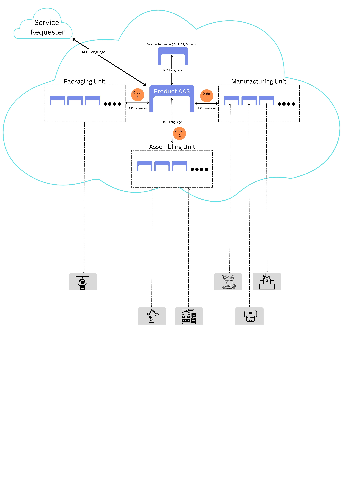
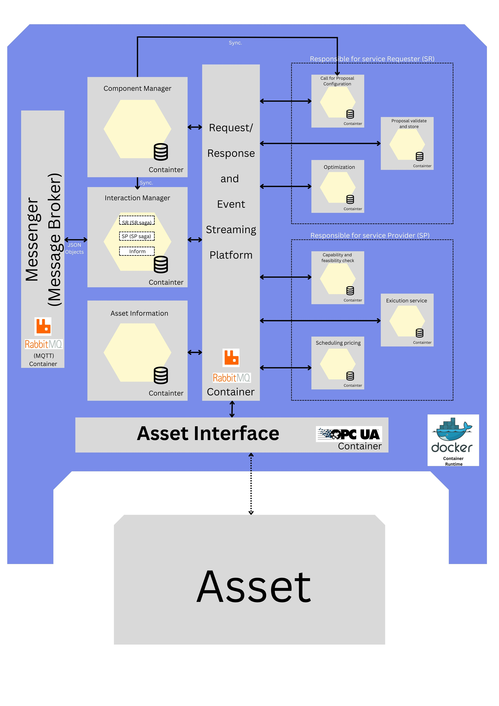

# Interoperability_in_I4.0

## 📖 Chapter 1: Project Overview

This project explores the concept of **interoperability in Industry 4.0** within an order-controlled industrial scenario. The illustration below shows how an active **Product Asset Administration Shell (AAS)** follows a predefined sequence of orders to complete its product instance process. The AAS acts both as a **service provider** and a **service requester**.

  

In this dynamic, the AAS is initially invoked by other services and subsequently initiates its own service requests to various providers including the **manufacturing unit**, **assembly unit**, and other relevant systems.

The autonomous execution of these processes requires a suite of intelligent algorithms. These are developed using a **microservices architecture** and deployed to the system. The figure below represents an active AAS alongside the supporting services and algorithms needed for the **Service Requester / Service Provider (SR/SP)** interaction model.

  

### 🔧 Core Services & Algorithms

The following services are essential for an active AAS to perform SR/SP functions:

- **Interaction Manager**
- **Component Manager**
- **Asset Information Service**
- **Asset Interface**
- **Call for Proposal Configuration**
- **Optimization**
- **Proposal Validation**
- **Execution Management**
- **Capability and Feasibility Check**
- **Pricing and Scheduling**

---

## 📖 Chapter 2: Implementation & Deployment

The services listed above are implemented as independent microservices using various platforms and programming languages, depending on their requirements.

Each microservice is maintained within a modular repository structure and includes its own **deployment scripts written in YAML** in the specified **K8S** (Kubernetes) folder. The overall solution adheres to modern **DevOps** practices, facilitating continuous development, testing, release management, and maintenance (including bug fixes and feature updates).

The CI/CD pipeline enables automated integration and deployment of services, as shown in the diagram below:

  

### 🚀 How with Azure Cloud Services (through Azure DevOps, AKS, and other services)

This section explaines how with leveraging the **Azure ecosystem** to build, test, deploy, and manage microservices-based architectures. Here's a step-by-step breakdown of how Azure services are used to streamline implementation and deployment:

---

#### 1️⃣ Infrastructure as Code with Terraform for Azure Resource Manager

We use **Terraform** to define and provision infrastructure in a consistent, repeatable manner. Terraform acts as our Infrastructure as Code (IaC) tool to create and manage:

* **Resource Groups**
* **AKS clusters (Azure Kubernetes Service)**
* **Azure Container Registry (ACR)**
* **Azure Key Vault**
* **Storage Accounts**
* **Networking resources (VNETs, Subnets, NSGs)**

 All infrastructure definitions are stored as `.tf` files and version-controlled in Azure Repos or GitHub, mentioned in the above Repo with folder **Resource Manager**.

---

#### 2️⃣ Source Code Management with Azure Repos

All service code and IaC definitions are managed in **Azure Repos** (or optionally GitHub). This allows teams to:

* Collaborate using Git repositories
* Perform code reviews via pull requests
* Manage branches, issues, and tags

---

#### 3️⃣ CI/CD Pipeline with Azure Pipelines

We create **multi-stage YAML pipelines** in **Azure Pipelines** to automate the following stages:

**🔹 Build Stage**

* Triggered on code commits
* Docker images are built for each microservice
* unit and integrating tests happen
* Images are pushed to **Azure Container Registry (ACR)**

**🔹 Release Stage**

* Deploys Docker images to **Azure Kubernetes Service (AKS)**
* Uses Kubernetes manifests stored in the repo with **K8S** folder
* For monitoring the deployment or managing **GitOps** or **Argo CD**

---

#### 4️⃣ Container Orchestration with Azure Kubernetes Service (AKS) or self-maneged Kubernetes

All microservices are deployed and managed using **AKS**, which offers:

* High availability and auto-scaling
* Network policies for secure communication between services
* Secrets management through **Azure Key Vault integration**
* Monitoring and logging using **Azure Monitor** or **Prometheus** and **Log Analytics**

 Helm charts or Kubernetes YAML files stored in **K8S** folder are used to define service deployments, ingress rules, config maps, and persistent volumes.

---

#### 📌 Summary Workflow:

1. Developer pushes code to Azure Repos
2. Azure Pipeline triggers build + test → Docker image
3. Image is pushed to ACR
4. Terraform provisions AKS & infrastructure if needed
5. Azure Pipeline deploys image to AKS
6. Azure Monitor tracks live status & logs